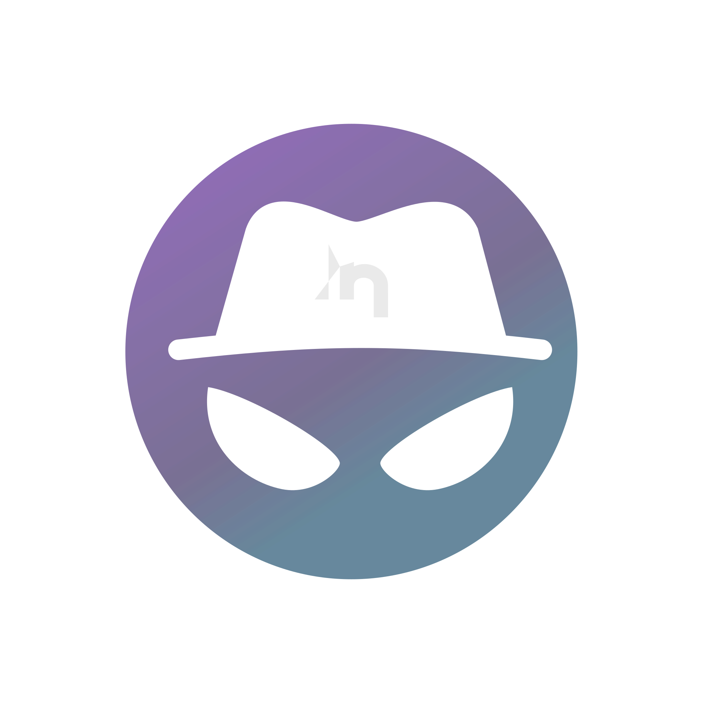

# PhantomLens Open Source Cluely Alternative

## Your Covert AI Weapon.

**The open-source, privacy-focused AI Assistant that works invisibly across your screen**

PhantomLens is an advanced, undetectable AI assistant that helps you with any on-screen task while respecting your privacy. Unlike commercial alternatives, PhantomLens is free, open-source and puts your privacy first.

## 📥 Download

PhantomLens is now available for download! Get the latest version for Windows:

**[Download from GitHub Releases →](https://github.com/inulute/phantom-lens/releases)**

> **Note:** Currently, PhantomLens is available for Windows only. macOS and Linux versions are coming soon!

## 🌟 Features

- **Truly Invisible**: Operates like a master thief - acquiring knowledge without leaving a trace in iykyk....
- **Context-Aware**: Sees what application you're using and tailors responses accordingly.
- **Open Source**: Transparent codebase you can inspect, modify, and trust

## ⌨️ Keyboard Shortcuts

PhantomLens comes with powerful keyboard shortcuts to help you work efficiently. Here are the available shortcuts:

### Global Shortcuts (Work anywhere)

| Shortcut | Action |
|----------|--------|
| `Ctrl + \` | Show/Hide PhantomLens window |

### Application Shortcuts (When window is visible)

| Shortcut | Action |
|----------|--------|
| `Ctrl + Enter` | Take screenshot and process |
| `Ctrl + R` | Reset/Cancel current operation |
| `Ctrl + ←→↑↓` | Move window (left, right, up, down) |
| `Alt + ↑↓` | Scroll response content |
| `Alt + ←→` | Scroll code blocks |
| `Ctrl + Shift + ↑↓` | Navigate history (previous/next) |
| `Ctrl + ,` | Open settings |
| `Ctrl + Shift + ,` | Enable interactive settings mode |
| `Ctrl + Q` | Quit application |
| `Ctrl + Shift + R` | Emergency window recovery |

> **Tip:** The global shortcut `Ctrl + \` works from anywhere on your system, even when PhantomLens is hidden. Use it to quickly toggle the window visibility!

## 🔄 How PhantomLens Differs from Cluely

|                       | PhantomLens | Others |
|-----------------------|---------|--------|
| **Privacy**           | ✅ Fully private, data stays local | ❌ Sends data to their servers |
| **Price**             | ✅ Free and open-source | ❌ Subscription-based |
| **Transparency**      | ✅ Open codebase | ❌ Closed source |
| **Customization**     | ✅ Fully customizable | ❌ Limited options |
| **Data Ownership**    | ✅ You own your data | ❌ Data used for training |

## ⚠️ Ethical Use

>[!NOTE]
>PhantomLens is intended for ethical use only. We do not condone cheating or any form of academic dishonesty. Use this tool responsibly and in accordance with your institution's guidelines. inulute is not responsible for any misuse of this software.

## 💎 SUPPORT THE PROJECT

  
  

---

## 🔍 SEE BEYOND. KNOW MORE.

PhantomLens works like a master knowledge thief - stealthily acquiring valuable information and delivering it to you without leaving a trace. Whether in meetings, interviews, or high-stakes conversations, get the right information at the right moment - completely hidden from everyone else.

---

## 🌐 CONNECT

  

  
Stay updated with the latest features and phantom knowledge.

---

## 🙏 Acknowledgments

Built with the initial codebase from [Jaden Park](https://github.com/jadenpxrk).

---

  

  

---

